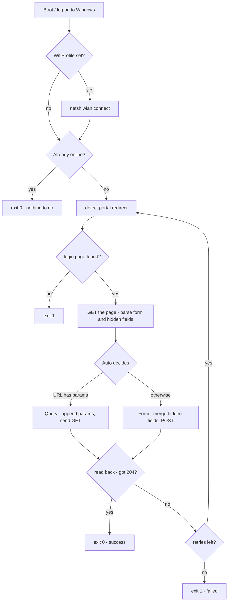

<div align="center">

# Campus Net Autoconnect

**Automatically complete your campus network's web portal login after Windows boots.**

Self-contained PowerShell · zero dependencies · password encrypted with Windows DPAPI

[](https://github.com/sixrg7734/ccsu-campus-network-login/actions/workflows/test.yml)
[](#compatibility)
[](#compatibility)
[](LICENSE)

English · [简体中文](README.md)

</div>

---

## What it is

Most university campus networks work like this: join the Wi-Fi, a login page pops up in your browser,
type your student ID and password, and only then do you get internet. Every single boot.

This project fills in **that form** for you and submits it, then verifies the network actually came up —
and retries if it did not.

## What it is not

- **Not a cracking tool.** It uses *your* credentials, on *your* account. There is no bypassing,
  spoofing, or credential guessing anywhere in it.
- **Not a universal connectivity tool.** It only handles **web portal** authentication. If your school
  requires a client application (Srun / Dr.COM / Ruijie / NetKeeper client mode), or uses PPPoE, this
  project does not apply.
- **No telemetry.** It talks to your school's portal and to the connectivity-check URL you configure.
  Nothing else.

---

## Features

| | |
|---|---|
| **Zero dependencies** | Windows PowerShell only. No Python, no Node, no libraries. Two `.ps1` files, copy and run |
| **Discovers the portal** | Nothing about your school is hardcoded. It detects the portal redirect at runtime and **parses the real field names and hidden parameters** (`wlanuserip`, `wlanacname`, `nasip`, …) out of the login page HTML |
| **Two submit modes** | `Query` (params in the URL, GET) and `Form` (parse the form, then POST). `Auto` picks for you |
| **Encrypted password at rest** | Windows DPAPI (CurrentUser scope). The ciphertext only decrypts for **the same user on the same machine** |
| **Never trusts "no error"** | After logging in it **reads back** to verify (a `generate_204` probe by default), retries on failure, and returns an honest exit code 1 when it could not connect |
| **Redacted logs** | The password is replaced with `***` before anything is written to the log |
| **Optional keep-alive** | The installer can add a "check every 10 minutes" trigger so you reconnect after drops |
| **Ships with tests** | The repo contains a **mock portal gateway** and drives the real script against it. 40 assertions you can run yourself |

---

## Quick start

```powershell
git clone https://github.com/sixrg7734/ccsu-campus-network-login.git
cd ccsu-campus-network-login

powershell -NoProfile -ExecutionPolicy Bypass -File .\Setup-CampusNet.ps1
```

The wizard walks you through detection, credentials, one real test login, and autostart installation.
**Press Enter to accept every default.** When it finishes, you are done: roughly 20 seconds after you
log into Windows, you will be online.

> **If the wizard cannot see a portal:** if you are *already online* there is no intercept page to
> capture, and the wizard will tell you so. To get accurate field names, disconnect the Wi-Fi (or
> unplug the cable) and run the wizard again.

To try it without installing autostart, answer `n` to the final question.

### Everyday commands

```powershell
.\Connect-CampusNet.ps1              # run once (exits immediately if already online)
.\Connect-CampusNet.ps1 -Force       # force one login attempt regardless
.\Connect-CampusNet.ps1 -Probe       # detect the portal, print field names, dump the page
.\Setup-CampusNet.ps1 -Test          # re-run one login attempt, change nothing
.\Setup-CampusNet.ps1 -Uninstall     # remove autostart
.\tests\Run-Tests.ps1                # run the full test suite (40 assertions)
```

---

## How it works



The important part: **the script makes no assumptions about your portal's shape.** It GETs the login
page, extracts every `<input>`'s `name` / `value` / `type`, and then fills in the fields you configured.
Session parameters like `wlanuserip` / `wlanacname` / `nasip` are **read from the page at runtime**,
not hardcoded.

---

## Layout

```
.
├── Connect-CampusNet.ps1            main script (this is what autostart runs)
├── Setup-CampusNet.ps1              wizard + autostart install/uninstall
├── campus-net.config.example.json   example config (the real one is gitignored)
├── tests/
│   ├── Mock-Portal.ps1              fake portal gateway (raw HTTP/1.1 over TcpListener)
│   └── Run-Tests.ps1                end-to-end tests against the mock portal
├── .github/workflows/test.yml       CI: parser lint + end-to-end tests
├── README.md / README.en.md
└── LICENSE
```

At runtime it creates `campus-net.config.json` and `连网日志.txt` next to the scripts (the log rotates
to `.old` past 512 KB). Both are gitignored.

---

## Configuration reference

The wizard fills most of this in. For hand-tuning:

| Key | Default | Meaning |
|---|---|---|
| `LoginUrl` | — | Full URL of the portal login page. Empty = auto-detect on every run |
| `PortalUrl` | — | A manually supplied portal URL; wins over auto-detection |
| `Mode` | `Auto` | `Auto` / `Url` / `Query` / `Form`. `Url` = replay a captured request (supports placeholders); `Auto` picks `Url` when `LoginUrl` contains `{placeholders}` |
| `UserField` | `username` | `name` of the account input |
| `PwdField` | `password` | `name` of the password input |
| `PwdTransform` | `plain` | `plain` / `base64` / `md5` |
| `PwdTemplate` | `{pwd}` | Placeholders: `{pwd}` `{plain}` `{b64}` `{b64d}` `{md5}` `{user}` `{token}` |
| `TokenRegex` | — | Regex to scrape a token from the login page; **capture group 1** feeds `{token}` |
| `ExtraFields` | — | Extra fixed parameters, e.g. `{"wlanacname":"xxx"}`. Values may use `{localip}` (this machine's outbound IP) and `{user}` |
| `Headers` | — | Extra request headers, e.g. `{"Referer":"http://..."}` |
| `User` | — | Account |
| `UserSuffix` | — | Suffix appended to the account. Dr.COM uses it to encode the carrier, e.g. `@lt` (Unicom), `@dx` (Telecom) |
| `PwdEnc` | — | DPAPI ciphertext. **Do not edit by hand** |
| `PwdPlain` | — | Plaintext escape hatch. When set, `PwdEnc` is ignored |
| `WifiProfile` | — | Saved Wi-Fi profile name to connect before logging in |
| `SuccessTestUrl` | `http://connect.rom.miui.com/generate_204` | Connectivity probe target |
| `SuccessStatus` | `204` | Expected status code |
| `SuccessRegex` | — | Expected body regex (overrides the status check) |
| `AllowInvalidCert` | `false` | Accept self-signed / expired TLS certs. **Some portals need this** — see below |
| `RetryCount` / `RetryDelaySec` | `6` / `10` | Retry policy |
| `LogFile` | `<script dir>\连网日志.txt` | Log path |

### Replaying a captured request (`Mode = Url`)

Some portals (CCSU included) build their login page entirely in JavaScript, so there is **no `<form>` at
all** and `-Probe` cannot enumerate anything. Use `Url` mode: paste the **real login request URL** you
captured from your browser, replace only the account / password / local-IP values with placeholders, and
the script substitutes and replays it on every run.

```json
"Mode": "Url",
"LoginUrl": "http://10.0.100.3:801/eportal/portal/login?user_account={user}&user_password={pwd}&wlan_user_ip={localip}"
```

Available placeholders:

| Placeholder | Expands to | URL-encoded |
|---|---|---|
| `{user}` | the account (with `UserSuffix` already appended) | yes |
| `{userraw}` | same, not encoded | no |
| `{pwd}` | the password (after `PwdTransform` / `PwdTemplate`) | yes |
| `{plain}` | the plaintext password | yes |
| `{b64}` | base64 of the password | yes |
| `{md5}` | md5 of the password | no |
| `{localip}` | this machine's outbound IP (changes with DHCP, hence the placeholder) | no |
| `{token}` | the token scraped by `TokenRegex` from the login page | yes |

Every other parameter is preserved verbatim, so you can paste the captured URL as-is and only edit those
three values. Leaving `Mode` at `Auto` also works: if `LoginUrl` contains `{placeholders}`, `Auto` picks `Url`.

### Per-portal recipes

| Portal family | Typical settings |
|---|---|
| Huawei / H3C standard portal | `Mode = Query`. The redirect URL already carries `wlanuserip` / `wlanacname` / `nasip`; only the credentials need substituting |
| Srun (深澜) | Often needs `PwdTransform = base64`. If the page carries a token, set `TokenRegex` and use `{token}` |
| Older Dr.COM | Commonly wants the password prefixed with `0` → `PwdTemplate = 0{pwd}` |
| Pure JS-rendered portals | See "Known limitations" |

### Changsha University (CCSU) reference

CCSU runs a **Dr.COM / 城市热点** portal at **`http://10.0.100.3/`** (auth API on port **801**).
The values below come from the portal's **own server-side config variables** and the university's
network centre — they are not guesses:

| Item | Value | Source |
|---|---|---|
| Wi-Fi SSIDs | `CCSU-Teacher` (staff) / `CCSU-Student` (students) | [University network centre guide](http://nic.ccsu.cn/info/1441/9601.htm) |
| Portal | `http://10.0.100.3/` | same |
| Auth endpoint | `http://10.0.100.3:801/eportal/?c=ACSetting&a=Login` | in-page `authloginpath` |
| **Account field** | **`DDDDD`** | in-page `authuserfield` |
| **Password field** | **`upass`** | in-page `authpassfield` |
| Page charset | `gb2312` | in-page `charset` |

**The "pick a carrier" step is not a dropdown — it is a radio group, and it works by APPENDING A
SUFFIX to the account.** The portal's own config says:

```js
carrier='{"yys":{"title":"服务类型","mode":"radiobutton","type":"0","data":[
  {"id":"1","name":"校园用户","suffix":""},
  {"id":"2","name":"校园电信","suffix":"@dx"},
  {"id":"3","name":"校园联通","suffix":"@lt"},
  {"id":"4","name":"校园其他","suffix":""}],"defaultID":"1"}}';
```

| What you pick | Account actually submitted | Config |
|---|---|---|
| 校园用户 (campus) | `2023000000` | `"UserSuffix": ""` |
| 校园电信 (Telecom) | `2023000000@dx` | `"UserSuffix": "@dx"` |
| 校园联通 (Unicom) | `2023000000@lt` | `"UserSuffix": "@lt"` |

> Supported natively since v1.1: `UserSuffix` is appended to the account, and a radio group now submits
> the **`checked` member**. (v1.0 submitted the *last* value in the group — that bug was found and fixed
> precisely because of this portal.)

A ready-to-copy config lives in
**[`campus-net.config.ccsu.example.json`](campus-net.config.ccsu.example.json)**.

#### One thing only you can do: capture a real login request

This portal's login page is **rendered entirely by JavaScript** (there is no `<form>` in the HTML), so
`-Probe` cannot enumerate the fields. Only a real login request reveals the full parameter set:

1. Open your browser's `F12` → **Network** tab → enable **Preserve log**
2. **Log out** of the campus network (or start from a logged-out state) and log in by hand once
3. Find the login request (its path usually contains `eportal`)
4. Right-click → **Copy as cURL**, or just read its **Query String / Form Data**

Then fill in the config according to the request shape:

- **GET (parameters in the URL)** → use `Mode = Url`, paste the whole URL into `LoginUrl`, and replace only
  the account, password and local IP with `{user}` / `{pwd}` / `{localip}`:

  ```json
  "Mode": "Url",
  "LoginUrl": "http://10.0.100.3:801/your captured URL, with the account as {user}, password as {pwd}, IP as {localip}"
  ```

- **POST (parameters in a form body)** → use `Mode = Form`, put the request target in `LoginUrl` and the
  remaining form fields in `ExtraFields` (use `{localip}` for `wlanuserip`).

`campus-net.config.ccsu.example.json` already contains a starting point in the GET shape — you only need
to swap `LoginUrl` for the request you captured.

> **Honest status:** field names and the carrier mechanism are confirmed. The **complete parameter set is
> not** — this machine is currently authenticated, so the logged-out login page could not be captured.
> That example config is a reasoned starting point derived from the portal's own config variables and its
> JavaScript, **not a verified working one**. Send me the captured cURL and I can finalise it.

---

## Troubleshooting

**`-Probe` reports no portal found.** In order of likelihood: you are already online (this is a normal,
correct result); the Wi-Fi is not associated (set `WifiProfile`); or your school uses a client
application, which this project does not support.

**Portal found, but login still fails.**
Check `UserField` / `PwdField` against the field list printed by `-Probe` (or the dumped HTML in
`门户探测结果.txt`). Try `PwdTransform` `base64` or `md5`. Configure `TokenRegex` / `ExtraFields` if the
page needs a token. **The most useful move:** open your browser's `F12` → `Network`, log in by hand once,
then right-click the login request → *Copy as cURL* — and copy the parameter names from it.

**"Password decryption failed".** DPAPI ciphertext is bound to one user on one machine. A new machine,
a new Windows account, a reinstall, or copying the config to someone else all break it. Re-run
`.\Setup-CampusNet.ps1`. If you genuinely need portability, put plaintext in `PwdPlain` — but that
stores your password in the clear.

**Certificate errors.** Campus portals frequently use self-signed or expired certificates. Set
`AllowInvalidCert: true` (or answer `y` in the wizard).

>  That disables certificate validation entirely, which weakens your protection against
> man-in-the-middle attacks. Only enable it if the portal genuinely uses a bad certificate.

**Run the scheduled task manually:**

```powershell
Start-ScheduledTask -TaskName 'CampusNet-Autoconnect'
Get-ScheduledTaskInfo -TaskName 'CampusNet-Autoconnect' | Select LastRunTime, LastTaskResult
```

---

## Testing

This project does not accept "the script did not throw" as evidence. The repo ships a **mock portal
gateway** (`tests/Mock-Portal.ps1`) that behaves like the real thing: `302` to a login page when
unauthenticated, `204` once authenticated.

`tests/Run-Tests.ps1` starts that gateway, **runs the real script against it**, and then checks what
the **portal side** actually received:

```powershell
.\tests\Run-Tests.ps1
```

Current status: **40/40 passing** on Windows PowerShell 5.1.

| Scenario | Assertions |
|---|---|
| **A** `Form` mode | exit 0 · portal received `POST /login` · portal reports success · **hidden fields from the page were carried along** |
| **B** `Query` mode | exit 0 · portal received a GET with `username` · **pre-existing query params were preserved** · success |
| **C** wrong password | exit 1 (honest failure) · portal logged `LOGIN-FAIL` |
| **D** DPAPI ciphertext | exit 0 · decrypted password round-trips correctly |
| **E** `-ProbeJson` contract | stdout is valid JSON · online state correct · portal URL detected · user/password fields guessed correctly · form action resolved · fields enumerated |
| **F** Dr.COM portal shape | account submitted with the `@lt` suffix · password sent as `upass` · **the radio group submits the `checked` member (neither the first nor the last)** · `{localip}` expanded to a real IP · static `ExtraFields` passed through · portal accepted the login |
| **G** `-ProbeJson` on a Dr.COM page | account guessed as `DDDDD` · password guessed as `upass` · **carrier guessed as `yys`** · radio group enumerated (3 options) · `<select>` parsed and bound to its `selected` option |
| **H** `Mode = Url` replay | exit 0 · `{user}` replaced with the `@lt`-suffixed account (URL-encoded) · `{pwd}` replaced · `{localip}` replaced with a real IP · literal params preserved verbatim · portal accepted the replay |

> Scenarios F/G are **built to catch the bug**: the checked radio in the mock page has value `2` while the
> options are ordered `1 / 2 / 3`. So both "keeps the first option" and "keeps the last option" fail
> loudly — v1.0 did the latter, which would have logged a Unicom user in as a campus user.

Scenario E covers the interface between `Setup-CampusNet.ps1` and `Connect-CampusNet.ps1`.

The suite is **fully hermetic** — every URL points at `127.0.0.1`, so it needs no internet and is safe
in CI. `.github/workflows/test.yml` runs it on every push.

---

## Security notes

- The password is encrypted with Windows DPAPI (`CurrentUser` scope). It only decrypts for the same
  user on the same machine. **After a reinstall or a machine change you must re-run the wizard.**
- **Autostart therefore triggers at *logon*, not at *boot*:** during boot the user's registry hive is
  not loaded yet, so DPAPI cannot decrypt. The installer uses `AtLogOn` with a 20-second delay.
- The scripts do not touch the registry or system settings. They only read and write their own directory.
- Passwords are replaced with `***` before being written to the log.
- `campus-net.config.json`, `连网日志.txt` and `门户探测结果.txt` are gitignored. **Check `git status`
  before committing.** The probe dump in particular contains a full portal page and may include your
  IP and MAC address.
- Without elevation, autostart falls back to a **Startup folder shortcut** (a `.lnk`, so non-ASCII paths
  work fine). It still works — it just has no keep-alive trigger. Re-run the wizard as administrator to
  get the scheduled task.

---

## Known limitations

- **Web portal authentication only.** No client-app authentication (Srun / Dr.COM / Ruijie / NetKeeper
  client modes), no PPPoE.
- **No CAPTCHA support.**
- **No support for portals that encrypt the password in browser-side JS** (RSA or custom schemes).
  The password is computed by the page's JavaScript and cannot be replayed. Workaround: capture the real
  login URL with `F12` → `Network`, put it in `LoginUrl`, and set `Mode = Query`.
- **Windows only** (DPAPI + Task Scheduler).
- The script needs the **plaintext** password in memory to submit a form — that is inherent to HTTP form
  authentication. DPAPI protects data **at rest**, not runtime memory.

---

## Compatibility

| | |
|---|---|
| OS | Windows 10 / 11 (Server 2016+ probably fine, untested) |
| PowerShell | Windows PowerShell 5.1 (primary target) and PowerShell 7 (exercised in CI) |
| Privileges | Works as a normal user. A keep-alive scheduled task needs administrator |

> **Contributing to the scripts:** `.ps1` files must be saved as **UTF-8 with BOM**. Windows PowerShell
> 5.1 decodes BOM-less UTF-8 using the system ANSI code page, which turns non-ASCII comments into
> mojibake and then into syntax errors. CI has a parser check to catch this.
>
>  If you batch-convert encodings, **only convert `.ps1` files**. Adding a BOM to `.md` / `.json` /
> `.yml` is actively harmful — a YAML file with a BOM makes GitHub Actions fail to parse the workflow.
> This bit us twice while building this repo, which is why every release is checked file-by-file for
> "`.ps1` has a BOM, everything else has none".

---

## Contributing

PRs welcome. Before submitting:

1. Run `.\tests\Run-Tests.ps1` and confirm 40/40;
2. If you changed `Connect-CampusNet.ps1`, **add a matching assertion to `Run-Tests.ps1`** — please do
   not rely on eyeballing it;
3. Make sure your `.ps1` files are UTF-8 with BOM.

If you successfully adapted this to your school's portal, a PR or issue with your config fragment
(**credentials stripped**) would help your classmates.

---

## License

[MIT](LICENSE).

## Disclaimer

This project is for automating login **to your own account**. Follow your institution's network usage
policy. You are responsible for how you use it; the authors accept no liability for misuse or damages.
