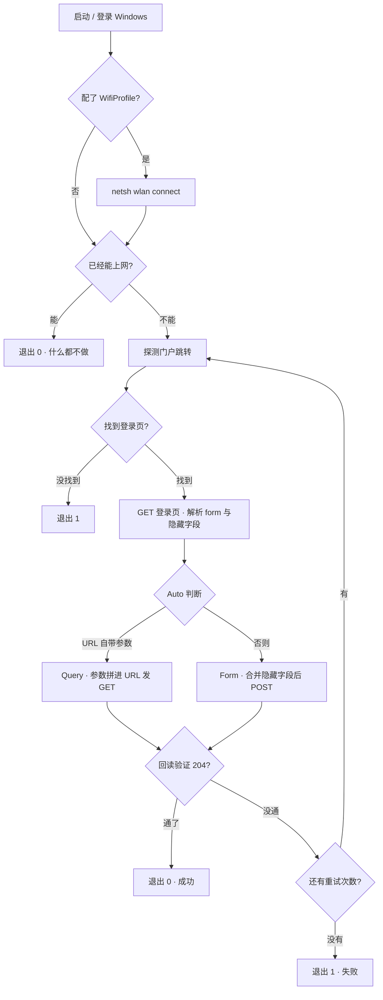

<div align="center">

# 校园网自动连接

**开机 / 登录 Windows 后，自动完成校园网网页 Portal 认证。不用再手动点那个登录页。**

一套自包含的 PowerShell 脚本 · 无需安装任何东西 · 密码用 Windows DPAPI 加密

[](https://github.com/sixrg7734/ccsu-campus-network-login/actions/workflows/test.yml)
[](#兼容性)
[](#兼容性)
[](LICENSE)

[English](README.en.md) · 简体中文

</div>

---

## 这是什么

大学校园网通常是「连上 Wi-Fi → 浏览器弹出登录页 → 输学号密码 → 才能上网」。每天开机都要来一遍，很烦。

这个项目把**那张表单自动填一遍并提交**，然后回头验证网络是不是真的通了；没通就重试。

## 这不是什么

- **不是破解工具。** 它用你自己的账号、你自己的密码，登录你自己的账号。没有任何绕过认证、伪造、弱口令尝试的行为。
- **不是通用上网工具。** 只处理「网页 Portal 认证」。学校要求装客户端软件（深澜/Dr.COM/锐捷/天翼等客户端模式），或者用 PPPoE 拨号的，本项目不适用。
- **不联网上报。** 不发遥测、不连第三方服务器。除了你学校的门户和你配置的联网检测地址，它谁也不连。

---

## 特性

| | |
|---|---|
| **零依赖** | 只用 Windows 自带的 PowerShell，不用装 Python / Node / 任何库。两个 `.ps1` 拷走就能用 |
| **自动识别门户** | 不写死你们学校的地址。运行时探测 Portal 跳转，并**从登录页 HTML 里解析出真实的字段名和隐藏参数**（`wlanuserip` / `wlanacname` / `nasip` 这类） |
| **两种提交方式** | `Query`（参数拼在 URL 上发 GET）和 `Form`（解析表单后 POST）。`Auto` 会自己判断 |
| **密码加密存储** | DPAPI（CurrentUser）加密，密文只有**同一台电脑 + 同一个 Windows 用户**能解开。配置文件被拷走也没用 |
| **不轻信「没报错」** | 认证后**回读验证**（默认探测 `generate_204`），没通就按配置重试。失败会如实返回退出码 1 |
| **日志脱敏** | 写日志前会把密码字段替换成 `***`，避免门户把密码回显到错误页时被记进日志 |
| **可选的掉线保活** | 装自启时可以加一个「每 10 分钟检查一次」的触发器，掉线自动重连 |
| **自带测试** | 仓库里有一个**假 Portal 网关**，对着它端到端跑真脚本。40 项断言，你 clone 下来就能自己验 |

---

## 快速开始

```powershell
# 1. 下载（任选其一）
git clone https://github.com/sixrg7734/ccsu-campus-network-login.git
# 或者直接把两个 .ps1 下载到一个文件夹里

cd ccsu-campus-network-login

# 2. 跑设置向导：探测门户 → 输账号密码 → 试跑 → 装开机自启
powershell -NoProfile -ExecutionPolicy Bypass -File .\Setup-CampusNet.ps1
```

向导会一步步问你，**一路回车就是用默认值**。跑完就装好了：以后登录 Windows 约 20 秒后自动连。

> **找不到配置时**：向导第 1 步会先探测门户。如果你此刻**已经在线**，是抓不到学校登录页的
> （因为根本没有拦截页）—— 这时向导会提醒你。想拿到准确的字段名，请先断开 Wi-Fi / 拔掉网线再跑一次。

只想看看能不能用、不想装自启：向导最后一步问「要装开机自启吗」时回答 `n`。

### 之后常用的命令

```powershell
.\Connect-CampusNet.ps1              # 手动跑一次（已联网就直接退出）
.\Connect-CampusNet.ps1 -Force       # 不管当前通不通，强制认证一遍
.\Connect-CampusNet.ps1 -Probe       # 只探测门户，打印字段名并导出页面 HTML
.\Setup-CampusNet.ps1 -Test          # 重新试跑一次，不改配置
.\Setup-CampusNet.ps1 -Uninstall     # 取消开机自启
.\tests\Run-Tests.ps1                # 跑一遍完整测试（40 项）
```

---

## 工作原理



关键点：**脚本不假设门户长什么样**。它先 GET 登录页，把页面里所有 `<input>` 的
`name` / `value` / `type` 抓出来，再把你配置的账号密码字段填进去。所以那些
`wlanuserip` / `wlanacname` / `nasip` 之类的会话参数是**运行时从页面拿的**，不是写死的。

---

## 目录结构

```
.
├── Connect-CampusNet.ps1            主脚本（开机自启跑的就是它）
├── Setup-CampusNet.ps1              设置向导 + 自启安装/卸载
├── campus-net.config.example.json   配置样例（真配置是 campus-net.config.json，已被 .gitignore 忽略）
├── tests/
│   ├── Mock-Portal.ps1              假 Portal 网关（TcpListener 手写 HTTP/1.1）
│   └── Run-Tests.ps1                端到端测试，对着假 Portal 跑真脚本
├── .github/workflows/test.yml       CI：语法检查 + 端到端测试
├── README.md / README.en.md
└── LICENSE
```

运行时会在脚本目录生成 `campus-net.config.json` 和 `连网日志.txt`（超过 512 KB 自动轮转为 `.old`）。
这两个都在 `.gitignore` 里，**不会**被提交。

---

## 配置字段

向导会自动填好大部分。需要手改时看这张表：

| 字段 | 默认 | 含义 |
|---|---|---|
| `LoginUrl` | — | 门户登录页完整地址。留空则每次运行时自动探测 |
| `PortalUrl` | — | 手填的门户地址，优先于自动探测。一般不用填 |
| `Mode` | `Auto` | `Auto` / `Url` / `Query` / `Form`。`Url` = 重放你抓包得到的请求（支持占位符）；`Query` = 参数拼在网址上发 GET；`Form` = 解析页面隐藏字段后 POST。`Auto` 自动判断：`LoginUrl` 里含 `{占位符}` 就用 `Url` |
| `UserField` | `username` | 学号输入框的 `name` |
| `PwdField` | `password` | 密码输入框的 `name` |
| `PwdTransform` | `plain` | 密码先做哪种变形：`plain` / `base64` / `md5` |
| `PwdTemplate` | `{pwd}` | 密码模板。可用 `{pwd}` `{plain}` `{b64}` `{b64d}`（两次 base64）`{md5}` `{user}` `{token}` |
| `TokenRegex` | — | 从登录页 HTML 里抠 token 的正则，**捕获组 1** 即 token，供 `{token}` 用 |
| `ExtraFields` | — | 额外固定参数，如 `{"wlanacname":"xxx","nasip":"1.2.3.4"}`。值里可用 `{localip}`（本机出口 IP，运行时自动填）和 `{user}` |
| `Headers` | — | 额外请求头，如 `{"Referer":"http://..."}` |
| `User` | — | 账号 |
| `UserSuffix` | — | 拼在账号后面的后缀。Dr.COM/城市热点 用它表达运营商，如 `@lt`（联通）、`@dx`（电信） |
| `PwdEnc` | — | DPAPI 加密后的密码。**不要手改** |
| `PwdPlain` | — | 明文密码逃生舱。留空即用 `PwdEnc` |
| `WifiProfile` | — | 要自动连接的 Wi-Fi 配置名，即「已保存的网络」里的名字 |
| `SuccessTestUrl` | `http://connect.rom.miui.com/generate_204` | 联网判定请求哪个网址 |
| `SuccessStatus` | `204` | 期望的状态码 |
| `SuccessRegex` | — | 期望的响应正则（配了就不用看状态码） |
| `AllowInvalidCert` | `false` | 允许自签名 / 过期证书。**部分学校门户必须打开**，但会降低安全性，详见下文 |
| `RetryCount` | `6` | 重试次数 |
| `RetryDelaySec` | `10` | 重试间隔（秒） |
| `LogFile` | `<脚本目录>\连网日志.txt` | 日志路径 |

### 重放抓包得到的请求（`Mode = Url`）

有些门户（比如长沙学院）的登录页是 JavaScript 动态生成的，页面里**根本没有 `<form>`**，
`-Probe` 解析不出任何字段。这种情况用 `Url` 模式：把你在浏览器里抓到的**真实登录请求地址**整条粘进来，
只把「账号 / 密码 / 本机 IP」这三个值换成占位符，脚本每次运行时会替换后再发出去。

```json
"Mode": "Url",
"LoginUrl": "http://10.0.100.3:801/eportal/portal/login?user_account={user}&user_password={pwd}&wlan_user_ip={localip}"
```

可用占位符：

| 占位符 | 替换成 | URL 编码 |
|---|---|---|
| `{user}` | 账号（已拼上 `UserSuffix`） | 是 |
| `{userraw}` | 同上，不编码 | 否 |
| `{pwd}` | 密码（已按 `PwdTransform` / `PwdTemplate` 变形） | 是 |
| `{plain}` | 明文密码 | 是 |
| `{b64}` | base64 后的密码 | 是 |
| `{md5}` | md5 后的密码 | 否 |
| `{localip}` | 本机出口 IP（DHCP 会变，所以必须用占位符） | 否 |
| `{token}` | 用 `TokenRegex` 从登录页抠出来的 token | 是 |

其余参数原样保留，所以你可以把抓到的 URL 整条贴进来，只改这三个值。
`Mode` 留 `Auto` 也行 —— 只要 `LoginUrl` 里出现 `{占位符}`，`Auto` 就会选 `Url`。

### 各校门户怎么填

| 门户类型 | 典型填法 |
|---|---|
| 华为 / H3C 等标准 Portal | `Mode = Query`。跳转地址里已带 `wlanuserip` / `wlanacname` / `nasip`，脚本只要替换账号密码字段就行 |
| 深澜 Srun | 多数版本密码要 `PwdTransform = base64`；若页面里有 token，配 `TokenRegex` 供 `{token}` 用 |
| Dr.COM 老版本 | 常见要把密码写成 `0` 开头 → `PwdTemplate = 0{pwd}` |
| 门户是纯 JS 渲染（抓不到 `<form>`） | 见下面「已知限制」 |

### 长沙学院（CCSU）配置参考

长沙学院用的是**城市热点 Dr.COM**，门户是 **`http://10.0.100.3/`**（认证接口在 **801** 端口）。
下列取值来自**门户自己吐出来的配置变量**和学校网络中心官网，不是猜的：

| 项目 | 值 | 来源 |
|---|---|---|
| 无线信号 | 教师 `CCSU-Teacher` / 学生 `CCSU-Student` | [网络中心《校园网上网操作指南》](http://nic.ccsu.cn/info/1441/9601.htm) |
| 门户地址 | `http://10.0.100.3/` | 同上 |
| 认证接口 | `http://10.0.100.3:801/eportal/?c=ACSetting&a=Login` | 门户页内 `authloginpath` |
| **账号字段名** | **`DDDDD`** | 门户页内 `authuserfield` |
| **密码字段名** | **`upass`** | 门户页内 `authpassfield` |
| 页面编码 | `gb2312` | 门户页内 `charset` |
| 登录成功标志 | `Dr.COMWebLoginID_3.htm` | 门户页内 `authsuccess` |

**「选择运营商」的真相：它不是下拉框，是一组单选按钮，而且做的是「往账号后面拼后缀」。**
门户里那段配置原文是：

```js
carrier='{"yys":{"title":"服务类型","mode":"radiobutton","type":"0","data":[
  {"id":"1","name":"校园用户","suffix":""},
  {"id":"2","name":"校园电信","suffix":"@dx"},
  {"id":"3","name":"校园联通","suffix":"@lt"},
  {"id":"4","name":"校园其他","suffix":""}],"defaultID":"1"}}';
```

所以：

| 你选的运营商 | 账号实际提交成 | 配置怎么写 |
|---|---|---|
| 校园用户 | `2023000000` | `"UserSuffix": ""` |
| 校园电信 | `2023000000@dx` | `"UserSuffix": "@dx"` |
| 校园联通 | `2023000000@lt` | `"UserSuffix": "@lt"` |

> 脚本从 v1.1 起原生支持这个：`UserSuffix` 会拼在账号后面，单选按钮组也会提交**被 `checked` 的那一项**
> （v1.0 会错误地提交最后一组值 —— 这正是发现这个门户后修掉的 bug）。

现成的配置文件在 **[`campus-net.config.ccsu.example.json`](campus-net.config.ccsu.example.json)**，
复制成 `campus-net.config.json` 即可。

#### 这一步必须你自己做：抓一次真实登录请求

这个门户的登录页是**纯 JS 渲染**的（页面里没有 `<form>`），所以 `-Probe` 解析不出字段，
**只有真实登录请求才能确定完整的参数集合**。两分钟就能拿到：

1. 浏览器按 `F12` → 切到 **Network** 面板 → 勾上 **Preserve log**
2. **退出校园网登录**（或在未登录状态下），手动登录一次
3. 在 Network 里找到那条登录请求（路径通常含 `eportal`）
4. 右键 → **Copy as cURL**，或直接看它的 **Query String / Form Data**

抓到之后按请求形态填配置：

- **请求是 GET（参数在网址上）** → 用 `Mode = Url`，把网址整条贴进 `LoginUrl`，
  只把账号、密码、本机 IP 分别换成 `{user}` / `{pwd}` / `{localip}`：

  ```json
  "Mode": "Url",
  "LoginUrl": "http://10.0.100.3:801/粘贴你抓到的完整网址，账号换成 {user}，密码换成 {pwd}，IP 换成 {localip}"
  ```

- **请求是 POST（参数在表单里）** → 用 `Mode = Form`，`LoginUrl` 填请求目标地址，
  其余表单参数填进 `ExtraFields`（`wlanuserip` 用 `{localip}`）。

`campus-net.config.ccsu.example.json` 里已经按 GET 形态写好了一个**起点**，你只需要把 `LoginUrl` 换成
自己抓到的那一条。

> **诚实说明**：字段名和运营商机制已经确认；**但完整参数集合没有确认** ——
> 本机当前已认证在线，抓不到未登录状态的登录页。那份示例配置是「依据门户自身吐出的配置变量和
> 它的 JS 推断出来的合理起点」，**不是已验证能用**。把抓到的 cURL 发我，我就能把它填准。

---

## 排错

**1. `-Probe` 说「没探测到门户」**

按可能性排序：

- 你已经在线了（这是正常结果，脚本此时直接判定无需认证）；
- Wi-Fi 没连上 → 填好 `WifiProfile`；
- 学校用的是客户端软件而不是网页 → 本项目不适用。

**2. 探测到门户了，但认证完还是不通**

- `UserField` / `PwdField` 填错了 → 看 `.\Connect-CampusNet.ps1 -Probe` 打印的字段列表，或导出到 `门户探测结果.txt` 的完整 HTML；
- 密码需要变形 → 试 `PwdTransform` 的 `base64` 或 `md5`；
- 需要 token 或额外参数 → 配 `TokenRegex` / `ExtraFields`；
- **抓一次真实登录请求来对照**（最有用的一招）：
  浏览器按 `F12` → `Network` → 手动登录一次 → 右键那条登录请求 → **Copy as cURL** 或看 URL 和
  Form Data，把参数名抄进配置。

**3. 提示「密码解密失败」**

DPAPI 密文绑定「这台电脑 + 这个 Windows 用户」。换电脑、换账户、重装系统、或者把配置文件拷给别人，
都会解不开 —— 重跑 `.\Setup-CampusNet.ps1` 输一次密码即可。

如果确实需要跨机器复用，可以把明文填进 `PwdPlain`（**但那样就是明文存密码了**，自己权衡）。

**4. 报证书错误 / 认证请求直接失败**

学校门户经常用自签名或过期证书。在配置里把 `AllowInvalidCert` 设成 `true`，或重跑向导时回答 `y`。

>  打开它意味着**不再校验证书**，理论上更容易被中间人攻击。只在「门户确实用坏证书」时打开，
> 并且别在公共 Wi-Fi 上长期开着。

**5. 想立刻手动验一次计划任务**

```powershell
Start-ScheduledTask -TaskName 'CampusNet-Autoconnect'
Get-ScheduledTaskInfo -TaskName 'CampusNet-Autoconnect' | Select LastRunTime, LastTaskResult
```

---

## 测试与验证

本项目不接受「脚本没报错就算成功」。仓库里有一个**假的校园网网关**
（`tests/Mock-Portal.ps1`），它模拟真实行为：未认证时 `302` 跳登录页、认证后返回 `204`。

`tests/Run-Tests.ps1` 会启动这个假网关，然后**真的运行主脚本**，最后从**门户端**核对收到的请求：

```powershell
.\tests\Run-Tests.ps1
```

当前结果 **40/40 通过**（Windows PowerShell 5.1）：

| 场景 | 断言 |
|---|---|
| **A** `Form` 模式 | 退出码 0 · 门户收到 `POST /login` · 门户判定登录成功 · **页面里的隐藏字段被一起提交** |
| **B** `Query` 模式 | 退出码 0 · 门户收到带 `username` 的 GET · **原有查询参数没被丢掉** · 登录成功 |
| **C** 密码错误 | 退出码 1（如实报失败）· 门户记录到 `LOGIN-FAIL` |
| **D** DPAPI 密文 | 退出码 0 · 解出的密码与原文一致 |
| **E** `-ProbeJson` 契约 | stdout 是合法 JSON · 在线状态正确 · 门户地址识别正确 · 账号/密码字段推测正确 · 表单 action 正确解析 · 字段枚举完整 |
| **F** Dr.COM / 城市热点 形态 | 账号带 `@lt` 后缀正确提交 · 密码发到 `upass` · **单选按钮提交的是被 `checked` 的那一项（不是第一项、也不是最后一项）** · `{localip}` 展开成真实 IP · 静态 `ExtraFields` 透传 · 门户接受登录 |
| **G** Dr.COM 页面的 `-ProbeJson` | 账号字段猜成 `DDDDD` · 密码字段猜成 `upass` · **运营商字段猜成 `yys`** · 单选组枚举出 3 个选项 · `<select>` 被解析且取 `selected` 项 |
| **H** `Mode = Url` 重放 | 退出码 0 · `{user}` 替换成带 `@lt` 后缀的账号（并正确 URL 编码）· `{pwd}` 替换成功 · `{localip}` 替换成真实 IP · 字面参数原样保留 · 门户接受重放 |

> 场景 F/G 是**故意设计成能识破 bug 的**：模拟页面里被 `checked` 的单选按钮值是 `2`，
> 而选项顺序是 `1 / 2 / 3`。所以「取第一项」和「取最后一项」两种写法都会失败 ——
> v1.0 正是后者，它会把联通用户登成校园用户。

场景 E 验的是 `Setup-CampusNet.ps1` 和 `Connect-CampusNet.ps1` 之间的接口 —— 向导靠它拿探测结果。

测试是**完全本地的**（所有 URL 都指向 `127.0.0.1`），不联网，所以可以放心在 CI 里跑。
`.github/workflows/test.yml` 已经配好，push 上去就会自动跑。

---

## 安全说明

- 密码用 Windows DPAPI（`CurrentUser` 作用域）加密。密文只有**当前用户在当前这台电脑上**能解开；
  配置文件被拷走也解不开。代价是**换机器 / 换用户 / 重装系统后必须重跑向导**。
- **因此开机自启用的是「登录时触发」而不是「开机时触发」** —— 开机时用户的配置单元还没加载，
  DPAPI 解不开密码。向导装的是 `AtLogOn` + 20 秒延迟。
- 脚本**不写注册表、不改系统设置**，只读写自己所在目录。
- 日志在落盘前会把密码替换成 `***`。
- `campus-net.config.json`、`连网日志.txt`、`门户探测结果.txt` 都已经在 `.gitignore` 里。
  **提交前请确认 `git status` 里没有它们。** 尤其是 `门户探测结果.txt`，里面有完整门户页面，
  可能包含你的 IP 和 MAC。
- 未提权运行时，自启会退化成「启动文件夹快捷方式」（`.lnk`，UTF-16，中文路径也没问题），
  功能正常，只是**没有掉线保活触发器**。想要保活就用管理员身份重跑一次向导。

---

## 已知限制

- **只支持网页 Portal 认证。** 客户端认证（深澜/Dr.COM/锐捷/天翼等客户端模式）和 PPPoE 拨号不支持。
- **不支持验证码（CAPTCHA）** 的门户。
- **不支持 JS 在浏览器端做 RSA / 自定义加密的门户。** 这类门户的密码是页面 JS 算出来的，
  脚本重放不出来。绕过办法：用 `F12` 抓一次真实登录的完整 URL，填进 `LoginUrl`，
  并把 `Mode` 设为 `Query`。
- **只支持 Windows**（依赖 DPAPI 和任务计划程序）。
- 脚本需要**明文密码**才能真正提交表单（这是 HTTP 表单认证的本质决定的）。
  DPAPI 加密保护的是「静态存储」，不是「运行时内存」。

---

## 兼容性

| | |
|---|---|
| 系统 | Windows 10 / 11（Windows Server 2016+ 应该也行，未测） |
| PowerShell | Windows PowerShell 5.1（主目标）、PowerShell 7（CI 里会跑一遍） |
| 权限 | 普通用户可跑。装带保活触发器的计划任务需要管理员 |

> **改这个仓库的脚本时注意**：`.ps1` 必须存成 **UTF-8 带 BOM**。Windows PowerShell 5.1 对
> 无 BOM 的 UTF-8 会按系统 ANSI 代码页解析，中文注释直接乱码并报语法错。CI 里有语法检查兜底。
>
>  如果你写脚本批量转 BOM，**只转 `.ps1`**。`.md` / `.json` / `.yml` 加上 BOM 是有害的 ——
> YAML 带 BOM 会让 GitHub Actions 直接解析失败。本项目开发时这个坑踩了两次，
> 所以每次发布前都按「`.ps1` 必须带 BOM、其余必须无 BOM」逐文件校验一遍。

---

## 贡献

欢迎 PR。提交前请：

1. 跑一遍 `.\tests\Run-Tests.ps1`，确认 40/40；
2. 如果你改了 `Connect-CampusNet.ps1`，**在 `Run-Tests.ps1` 里加一条对应的断言** ——
   请不要只靠肉眼看；
3. 确认 `.ps1` 是 UTF-8 带 BOM。

如果你成功适配了某个具体学校的门户，欢迎把配置片段（**去掉账号密码**）提 PR 或开 issue，
方便同校的同学直接抄。

---

## 许可

[MIT](LICENSE)。

## 免责声明

本项目仅供**个人在自己账号上**自动化登录使用。请遵守你所在学校的网络使用规定。
使用者需自行承担因使用本工具产生的一切后果。作者不对任何滥用或由此造成的损失负责。
